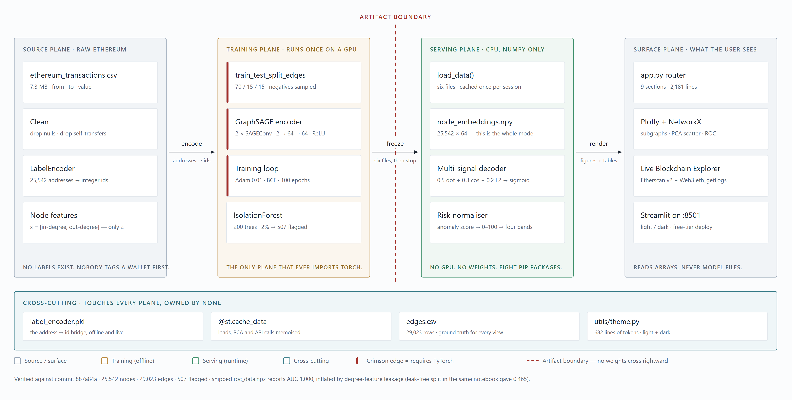
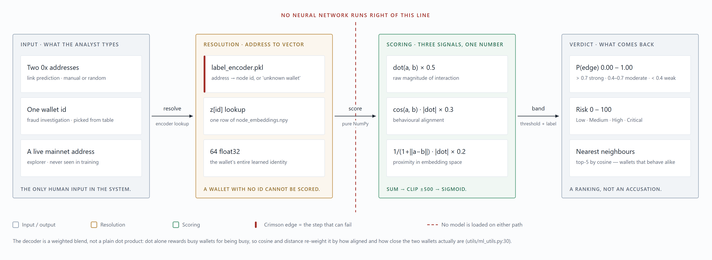

# ChainIntel Pro

**Link prediction and unsupervised fraud detection over the Ethereum transaction graph, using a GraphSAGE Graph Neural Network.**

Ethereum data is public but not *understandable*. A raw transaction list tells you that address A sent ETH to address B — nothing about who they are, what they belong to, or what they will do next. ChainIntel Pro treats the chain as what it actually is: a graph. It learns a 64-dimensional behavioural fingerprint for every wallet, then uses those fingerprints to answer two questions — *will these two wallets ever transact?* and *which wallets behave nothing like the rest of the network?*

[](https://deepwiki.com/Professional50coder/blockchain-gnn-link-prediction)


---

## Architecture

The defining decision in this project is the **artifact boundary**. Training runs once, in a notebook, on a GPU, and writes six files. The dashboard reads those six files and never imports PyTorch — which is why it deploys to a free CPU tier and cold-starts in seconds.



Both query paths bottom out in the same embedding table. Link prediction reads two rows of it; fraud scoring reads one.



> Source files for both diagrams live in [`docs/`](docs/) as SVG, so they scale cleanly for slides and print.

---

## What it does

| Capability | How | Why it matters |
|---|---|---|
| **Link prediction** | Score any wallet pair from their learned embeddings | Counterparty risk, entity clustering, exchange screening |
| **Fraud detection** | Isolation Forest over embeddings — no labels needed | Surfaces 507 wallets to review instead of 25,542 |
| **Embedding explorer** | PCA of all 25,542 wallets into 2D/3D | Visual proof the embeddings carry structure |
| **Live chain lookup** | Etherscan v2 + Web3.py `eth_getLogs` | Score a mainnet address against the trained model |

---

## Quick start

```bash
git clone https://github.com/Professional50coder/blockchain-gnn-link-prediction.git
cd blockchain-gnn-link-prediction

pip install -r requirements.txt
streamlit run app.py
```

Opens at `http://localhost:8501`. All six model artifacts are committed, so there is nothing to train first.

### Optional configuration

The Live Blockchain Explorer works without configuration on rate-limited public endpoints. For reliable use, supply your own:

```bash
# free key from https://etherscan.io/myapikey
export ETHERSCAN_API_KEY="your_key_here"

# any Alchemy / Infura / QuickNode mainnet endpoint
export WEB3_PROVIDER_URL="https://eth-mainnet.g.alchemy.com/v2/your_key"
```

On Windows PowerShell, use `$env:ETHERSCAN_API_KEY = "your_key_here"`.

---

## Dashboard sections

| # | Section | What it gives you |
|---|---|---|
| 1 | 🏠 Overview | Headline metrics, connection status, methodology |
| 2 | 📊 Graph Analytics | Degree distributions, power-law check, transaction explorer |
| 3 | 🔮 Link Prediction | Wallet-pair probability, plus a decoder signal breakdown |
| 4 | 🚨 Fraud Detection | Ranked risk table, per-wallet investigation, flagged counterparties |
| 5 | 📈 Model Performance | Training loss, ROC curve, evaluation summary |
| 6 | 🏗️ Architecture & ML | Interactive pipeline diagram, forward-pass maths, hyperparameters |
| 7 | 🧬 Embedding Space | PCA scatter of all wallets, nearest-neighbour search |
| 8 | 🌐 Network Visualization | Directed subgraph around any wallet |
| 9 | 🔌 Live Blockchain Explorer | Live balance, transactions, decoded ERC-20 logs, GNN cross-reference |

---

## How it works

### Graph construction

Every wallet becomes a node, every transfer a directed edge.

```
25,542 nodes  ·  29,023 edges  ·  2 node features per wallet (in-degree, out-degree)
```

Node features are deliberately minimal — the point is to make the model learn structure rather than be handed it.

### Encoder

Two-layer GraphSAGE. Each layer aggregates a wallet's neighbours into its own representation, so after two layers every vector encodes a two-hop neighbourhood.

```python
SAGEConv(2, 64) → ReLU → SAGEConv(64, 64)   # → 64-d embedding per wallet
```

Trained for 100 epochs with Adam (lr 0.01), binary cross-entropy with logits, and negative edges resampled every epoch on a 70/15/15 edge split.

### Decoders

Two heads read the same embedding table:

- **Link prediction** — a weighted blend rather than a plain dot product, because dot product alone conflates direction with magnitude and rewards busy wallets for merely being busy:

  ```
  0.5·dot(a,b) + 0.3·cos(a,b)·|dot| + 0.2·(1/(1+‖a−b‖))·|dot|  →  clip ±500  →  sigmoid
  ```

- **Fraud detection** — Isolation Forest (200 trees, 2% contamination) over the 64-d embeddings, normalised to a 0–100 risk score in four bands.

---

## Results, honestly

| Metric | Value | Read this before quoting it |
|---|---|---|
| Wallets flagged | 507 of 25,542 | 2% by construction — this is the contamination parameter, not a discovery |
| Training loss | 20,741 → 823 over 100 epochs | Unstable across epochs; unnormalised degree features produce very large logits |
| Test ROC-AUC (`roc_data.npz`) | **1.000** | **Inflated.** See below |
| Test ROC-AUC (earlier run, same notebook) | **0.465** | Worse than random |

**The AUC of 1.000 should not be quoted as a result.** Node features are in-degree and out-degree computed over the *full* edge list, including the held-out test edges. Random negative pairs are overwhelmingly low-degree, so degree alone separates test positives from negatives almost perfectly — the classic feature-leakage failure in link prediction. Recomputing degrees from training edges only is the fix, and it is the first item on the roadmap.

A second known gap: the notebook trains with a plain dot-product decoder, while the dashboard scores with the three-signal blend above. The served probabilities are a reasonable heuristic, but they are not the decoder the model was optimised for.

---

## Project structure

```
├── app.py                      # Streamlit dashboard, 9 sections (2,181 lines)
├── utils/
│   ├── blockchain.py           # Etherscan v2 REST + Web3.py event log decoding
│   ├── ml_utils.py             # Link probability, PCA, risk normalisation
│   ├── theme.py                # Design tokens + CSS injection
│   └── viz.py                  # Plotly and NetworkX figures
├── Link_Prediction.ipynb       # Training notebook (PyTorch Geometric)
├── save_dashboard_data.py      # Exports the six artifacts from the notebook
├── docs/
│   ├── architecture.png/.svg   # System architecture diagram
│   ├── query-paths.png/.svg    # Request path diagram
│   └── ROADMAP.md              # Prioritised enhancement plan
│
│   # committed model artifacts — the interface between training and serving
├── node_embeddings.npy         # 25,542 × 64 float
├── label_encoder.pkl           # address ↔ node id
├── edges.csv                   # 29,023 from_id / to_id
├── fraudulent_wallets.csv      # 507 flagged wallets + scores
├── loss_history.npy            # 100 epochs
└── roc_data.npz                # fpr / tpr / auc
```

---

## Retraining

Open `Link_Prediction.ipynb` in Colab, run it end to end, then run `save_dashboard_data.py` to regenerate all six artifacts. Drop them in the repository root and the dashboard picks them up — no application changes required.

---

## Limitations

- **Snapshot, not a stream.** Trained on 29,023 transactions. A wallet created after training has no embedding and cannot be scored.
- **Anomalous ≠ criminal.** Isolation Forest flags structural outliers. High-volume exchange hot wallets and contract deployers are structurally unusual too. Treat the output as a review queue, not an accusation.
- **No temporal modelling.** The edge split is random, not chronological, so the model answers "is this edge plausible" rather than "will this edge happen next".
- **Two node features.** Value, gas, timing and token type are all discarded during graph construction.

---

## Roadmap

A prioritised plan covering correctness, model quality, engineering, security and deployment lives in **[docs/ROADMAP.md](docs/ROADMAP.md)**.

---

## Acknowledgments

- **Dataset** — Google BigQuery Ethereum Public Dataset
- **Model** — GraphSAGE, [Hamilton et al., 2017](https://arxiv.org/abs/1706.02216)
- **Frameworks** — PyTorch Geometric, Streamlit, Plotly, scikit-learn, Web3.py

## License

Educational and research use.
