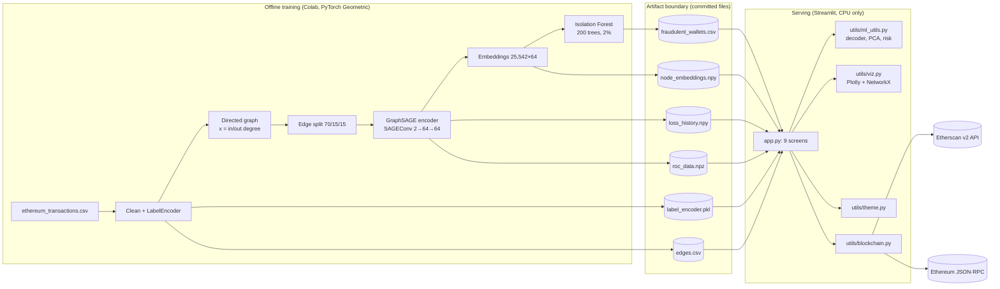
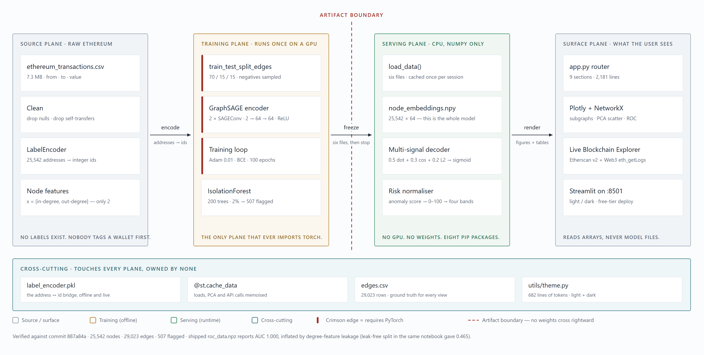
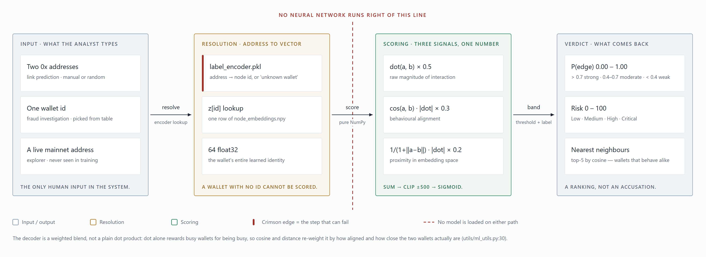

# ChainIntel Pro

**Link prediction and unsupervised anomaly scoring over an Ethereum transaction graph, using GraphSAGE embeddings served from a CPU-only Streamlit dashboard.**

[](https://deepwiki.com/Professional50coder/blockchain-gnn-link-prediction)


| | |
|---|---|
| **Live app** | https://blockchain-gnn-link-prediction.streamlit.app/ |
| **Source** | https://github.com/Professional50coder/blockchain-gnn-link-prediction |
| **Code Q&A** | https://deepwiki.com/Professional50coder/blockchain-gnn-link-prediction |

**At a glance**

- A two-layer GraphSAGE encoder turns each of **25,542 wallets** in a **29,023-edge** transaction graph into a 64-dimensional embedding.
- The same embedding table answers two questions: *how likely are these two wallets to transact?* (link prediction) and *which wallets look structurally unlike the rest?* (Isolation Forest, **507 wallets flagged**).
- Training happens offline in a notebook. The dashboard loads six saved files and never imports PyTorch, so it runs on a free CPU host.

## Contents

1. [The problem](#the-problem)
2. [Why we built it](#why-we-built-it)
3. [What it does](#what-it-does)
4. [Use cases](#use-cases)
5. [Product tour](#product-tour)
6. [How it works](#how-it-works)
7. [Architecture](#architecture)
8. [Models and why](#models-and-why)
9. [Design decisions](#design-decisions)
10. [Feature matrix](#feature-matrix)
11. [Limits](#limits)
12. [Compared with rule-based screening](#compared-with-rule-based-screening)
13. [Tech stack](#tech-stack)
14. [Repository layout](#repository-layout)
15. [Running locally](#running-locally)
16. [Testing](#testing)
17. [Deploying](#deploying)
18. [Roadmap](#roadmap)

---

## The problem

Ethereum data is public, but a list of transfers is hard to read. It tells you that address A sent value to address B. It does not tell you which wallets behave alike, whether two wallets are likely to interact, or which wallets do not fit the network's normal patterns.

Questions like these come up in counterparty screening, compliance triage and on-chain research. Answering them by hand means writing per-address queries and heuristics. ChainIntel Pro treats the chain as a directed graph and learns one representation per wallet that both questions can use.

## Why we built it

The project began as a Colab notebook (`Link_Prediction.ipynb`). It trains GraphSAGE on a snapshot of Ethereum transfers, then runs Isolation Forest on the resulting embeddings. The dashboard was added later so the results could be explored, and so a live mainnet address could be checked against the trained model, without re-running the notebook. Several of the notebook's weaknesses are documented below and not hidden. The roadmap in [`docs/ROADMAP.md`](docs/ROADMAP.md) was written from the source code, not from the earlier documentation.

## What it does

| Capability | Problem it removes |
|---|---|
| **Wallet-pair link probability** from learned embeddings | Judging how likely two wallets are to interact without hand-written heuristics |
| **Unsupervised anomaly scoring** (Isolation Forest on embeddings, normalised to a 0–100 risk score with four tiers) | No labelled fraud set is needed to build a review queue |
| **Per-wallet investigation** (risk breakdown, transactions, flagged counterparties, embedding statistics, top-5 cosine neighbours) | Jumping between tools to understand why a wallet stands out |
| **Embedding explorer** (2D/3D PCA, nearest-neighbour search) | Checking that the embeddings actually carry structure |
| **Subgraph visualisation** (1- or 2-hop, four layouts) | Seeing a wallet's local neighbourhood instead of reading edge lists |
| **Live chain lookup** (Etherscan v2 REST + Web3.py `eth_getLogs` decoding of ERC-20 `Transfer` events) | Connecting a mainnet address to its score in the trained graph |
| **CSV export** of predictions, the fraud table, investigations, transactions and event logs | Copying results out by hand |

## Use cases

- **Review-queue triage.** Rank wallets by structural anomaly and send the top of the list to an analyst. The output is a candidate list, not a verdict (see [Limits](#limits)).
- **Counterparty context.** Look up a mainnet address. If it is in the training graph, see its degree, counterparties and risk tier.
- **Entity exploration.** Find wallets whose embeddings sit close to a wallet of interest.
- **Teaching and demonstration.** The *Architecture & ML* screen shows the forward pass, the decoder and how Isolation Forest scores wallets, next to live values.

## Product tour

The sidebar has a light/dark theme toggle, dataset counters, connection status for Etherscan and the Web3 RPC, and a short model card. It navigates between nine screens, all in `app.py`.

| # | Screen | What you can do |
|---|---|---|
| 1 | Overview | Headline metrics, connection status, a methodology expander |
| 2 | Graph Analytics | Degree distributions, a power-law check, and a transaction explorer you can filter by numeric wallet ID |
| 3 | Link Prediction | *Manual*: enter two addresses, get a probability and a decoder-signal breakdown. *Random*: 5–30 random pairs, exportable as CSV |
| 4 | Anomaly Detection | Risk table filtered by tier and minimum score. Per-wallet investigation with tabs for risk, transactions, network and embedding (8×8 heatmap, top-5 similar wallets) |
| 5 | Model Performance | Training-loss curve, ROC curve and an evaluation summary table |
| 6 | Architecture & ML | Animated pipeline diagram. Tabs for layers, forward-pass maths, decoder (with a live two-wallet breakdown), Isolation Forest, and config |
| 7 | Embedding Space | PCA scatter of 1,000–6,000 sampled wallets, with an optional highlighted wallet and K-nearest-neighbour search |
| 8 | Network Visualization | Directed subgraph around any wallet. Up to 100 edges, 1- or 2-hop, spring/kamada/circular/shell layouts. Also a "top suspicious networks" view |
| 9 | Live Blockchain Explorer | Balance, transactions, token transfers, decoded ERC-20 event logs (1,000–50,000 block look-back), a GNN cross-reference and contract details for any mainnet address |

## How it works

1. **Ingest.** The notebook reads `ethereum_transactions.csv` (`from_address`, `to_address`, `value`, `block_timestamp`, `gas`, `gas_price`). It drops rows with a missing endpoint and drops self-transfers. The in-app methodology names the Google BigQuery Ethereum public dataset as the source. The extraction query is not in the repository.
2. **Build the graph.** A `LabelEncoder` maps each address to an integer node ID. Each transfer becomes a directed edge `from_id → to_id`. Node features are two numbers per wallet: out-degree and in-degree.
3. **Split.** `train_test_split_edges` holds out 15% of edges for validation and 15% for test. In the recorded run that gives 19,908 train, 2,502 validation and 2,502 test positive edges.
4. **Train.** The GraphSAGE encoder is trained for 100 epochs to tell real training edges apart from an equal number of negative edges, resampled each epoch.
5. **Embed.** The encoder runs once over the training edges and produces a 25,542 × 64 embedding matrix.
6. **Score anomalies.** Isolation Forest (200 trees, contamination 0.02, `random_state=42`) is fit on the embeddings. Wallets labelled `-1` are written to `fraudulent_wallets.csv` with their raw `decision_function` score.
7. **Export.** Six artifacts are saved: embeddings, label encoder, edge list, flagged wallets, loss history and ROC data. `save_dashboard_data.py` does the same for a notebook session.
8. **Serve.** `app.py` loads the artifacts with `@st.cache_data`. It computes link probabilities on demand with `utils/ml_utils.compute_link_probability`. It rescales the flagged wallets' raw scores to a 0–100 risk score and assigns tiers: Critical ≥ 80, High ≥ 60, Medium ≥ 35, Low below that.

## Architecture

The key structural decision is the **artifact boundary**. Everything above it needs PyTorch Geometric and ideally a GPU. Everything below it needs only NumPy, pandas, scikit-learn and Streamlit.


```mermaid
flowchart LR
    subgraph Offline["Offline training (Colab, PyTorch Geometric)"]
        A[ethereum_transactions.csv] --> B[Clean + LabelEncoder]
        B --> C[Directed graph<br/>x = in/out degree]
        C --> D[Edge split 70/15/15]
        D --> E[GraphSAGE encoder<br/>SAGEConv 2→64→64]
        E --> F[Embeddings 25,542×64]
        F --> G[Isolation Forest<br/>200 trees, 2%]
    end

    subgraph Artifacts["Artifact boundary (committed files)"]
        H[(node_embeddings.npy)]
        I[(label_encoder.pkl)]
        J[(edges.csv)]
        K[(fraudulent_wallets.csv)]
        L[(loss_history.npy)]
        M[(roc_data.npz)]
    end

    subgraph Serving["Serving (Streamlit, CPU only)"]
        N[app.py: 9 screens]
        O[utils/ml_utils.py<br/>decoder, PCA, risk]
        P[utils/viz.py<br/>Plotly + NetworkX]
        Q[utils/blockchain.py]
        R[utils/theme.py]
    end

    S[(Etherscan v2 API)]
    T[(Ethereum JSON-RPC)]

    F --> H
    B --> I
    B --> J
    G --> K
    E --> L
    E --> M
    H & I & J & K & L & M --> N
    N --> O & P & R
    N --> Q
    Q --> S
    Q --> T
```

Static versions of the architecture and request-path diagrams are in [`docs/`](docs/):





### Components

| Component | File | Responsibility |
|---|---|---|
| Training notebook | `Link_Prediction.ipynb` | Graph construction, GraphSAGE training, Isolation Forest, artifact export |
| Artifact exporter | `save_dashboard_data.py` | Writes the six artifacts from a live notebook session |
| Dashboard | `app.py` | Data loading, sidebar, nine screens |
| ML helpers | `utils/ml_utils.py` | Multi-signal link probability, PCA projection, cosine top-k, risk normalisation and tiers, graph statistics |
| Chain client | `utils/blockchain.py` | Etherscan v2 calls (balance, txs, token transfers, contract check, tx count). Web3 connection and ERC-20 `Transfer` log decoding. A lookup table of known DeFi protocol addresses |
| Visualisation | `utils/viz.py` | Loss/ROC/fraud charts, PCA scatter, network subgraph, architecture diagram and animation, decoder signals, timelines, degree distributions |
| Theme | `utils/theme.py` | Light/dark palettes and CSS injection |
| Sample generator | `generate_sample_data.py` | Writes *random* placeholder artifacts (1,000 wallets, 5,000 transactions) for UI testing only |

### Data schema

| File | Shape / columns | Notes |
|---|---|---|
| `ethereum_transactions.csv` | `from_address, to_address, value, block_timestamp, gas, gas_price` | Raw input. See [Limits](#limits) on how it relates to the committed artifacts |
| `edges.csv` | `from_id, to_id` (29,023 rows) | Integer node IDs from the label encoder |
| `node_embeddings.npy` | 25,542 × 64 float | Row *i* is the embedding of node ID *i* |
| `label_encoder.pkl` | scikit-learn `LabelEncoder` | Address ↔ node ID |
| `fraudulent_wallets.csv` | `wallet_id, fraud_label, fraud_score, wallet_address` (507 rows) | `fraud_label = -1` for every row. `fraud_score` is Isolation Forest's `decision_function` (lower means more anomalous) |
| `loss_history.npy` | 100 floats | Per-epoch training loss |
| `roc_data.npz` | `fpr`, `tpr`, `auc` | Test-split ROC data shown on the Model Performance screen |

`app.py` adds two columns at load time: `risk_score` (0–100) and `risk_level` (tier).

## Models and why

**Encoder: GraphSAGE** ([Hamilton et al., 2017](https://arxiv.org/abs/1706.02216)), as defined in the notebook:

```python
SAGEConv(2, 64) → ReLU → SAGEConv(64, 64)   # 64-d embedding per wallet
```

GraphSAGE learns an aggregation function over neighbours instead of a fixed embedding per node. That makes it the natural choice for a graph that will grow and be sampled. After two layers each embedding summarises a wallet's two-hop neighbourhood.

**Training setup** (from the notebook):

| Setting | Value |
|---|---|
| Input features | 2 (out-degree, in-degree), unnormalised |
| Hidden / output dim | 64 / 64 |
| Optimiser | Adam, lr 0.01 |
| Loss | `binary_cross_entropy_with_logits` |
| Negatives | `negative_sampling`, one per positive edge, resampled each epoch |
| Epochs | 100, fixed (no early stopping) |
| Split | 70 / 15 / 15 via `train_test_split_edges` |
| Training decoder | Dot product `(z[u] * z[v]).sum()` |

**Serving decoder.** The dashboard does not use the training decoder. It uses a weighted blend in `utils/ml_utils.py`:

```
combined = 0.5·dot(a,b) + 0.3·cos(a,b)·|dot| + 0.2·(1/(1+‖a−b‖))·|dot|
p = sigmoid(clip(combined, −500, 500))
```

The intent is to reduce the dot product's bias toward high-magnitude (busy) wallets. The model was not optimised for this blend, so the served probabilities are a heuristic built on the embeddings, not calibrated model outputs.

**Anomaly model: Isolation Forest** (scikit-learn; 200 estimators, contamination 0.02). It needs no labels, which matches the data: the repository has no ground-truth fraud labels. Because contamination is fixed at 2%, the number of flagged wallets (507 of 25,542) is a parameter choice, not a finding.

**Recorded results.** These are the only metrics written as text in the repository, from the notebook's printed output:

| Run | Metric | Value |
|---|---|---|
| Notebook, first training run | Test ROC-AUC (dot-product decoder) | 0.4646 |
| Notebook, final training run (the one saved to `loss_history.npy`) | Training loss, epoch 1 → epoch 100 | 20,741.6 → 823.1 |

The final run's printed loss swings between about 780 and 20,500 across epochs, so it does not decrease steadily. The ROC data behind the Model Performance screen is in `roc_data.npz`. Do not quote that AUC as a result. Node features are degrees computed over the **full** edge list, before the split, so held-out test edges leak into the features. Random negative pairs are mostly low-degree, so degree alone separates them from real edges. Recomputing features from training edges only is item A1 in the roadmap.

**Leakage-free re-evaluation.** [`train_lp.py`](train_lp.py) splits the edges first, then builds node features and message-passing edges from the training edges only (same two-layer GraphSAGE, 64-d, Adam lr 0.01, 100 epochs, best validation epoch kept). Message passing uses 80% of the training edges and the loss is computed on the other 20%, so no edge is both aggregated over and scored. It runs on the committed `ethereum_transactions.csv` (37,116 addresses, 39,680 unique directed edges), not on the older graph behind the shipped artifacts, and writes [`metrics.json`](metrics.json) without touching the dashboard files. Run `python train_lp.py` (needs only `torch`, `numpy`, `pandas`, `scikit-learn`).

| Model (test edges, random negatives) | ROC-AUC |
|---|---|
| GraphSAGE, train-only features, supervision-only edges | 0.775 |
| Baseline: log-degree sum from train edges (no learning) | 0.855 |

Two things this shows. First, with leakage removed the GNN scores well above the notebook's 0.465, but a non-learned degree baseline still beats it (0.855), so the model is mostly recovering degree and the 2-feature input gives it little else to use. Second, validation AUC peaks in the first epochs and then collapses (to about 0.29 by epoch 100) even with supervision-only edges, so training for a fixed 100 epochs is harmful here and the best-validation checkpoint is what is reported. The cause is not established; candidates are the dot-product decoder rewarding embedding magnitude and the uniform random negatives being mostly low-degree. Richer node features, hard negatives, a temporal split and ranking metrics are the next steps (roadmap A2 onward). The shipped dashboard artifacts have not been regenerated from this run.

## Design decisions

| Decision | Why | Trade-off |
|---|---|---|
| Train offline, serve from saved artifacts | The dashboard has no PyTorch dependency, starts fast and fits free CPU hosting | Embeddings are a snapshot. New wallets cannot be scored without retraining |
| Commit the artifacts to git | `streamlit run app.py` works right after cloning, and the hosted app needs no build step | About 6.5 MB of binaries in the repo. `.gitignore` explicitly un-ignores only the three NumPy artifacts |
| Degree-only node features | Forces the model to learn from structure | Throws away value, gas and timing. Causes the leakage described above. Large logits needed the ±500 clip |
| Unsupervised anomaly detection | No labelled fraud data is available | Flags "unusual", not "illicit". The flag rate is set by the contamination parameter |
| Multi-signal serving decoder | Reduces magnitude bias of a raw dot product | Differs from the training objective, and its probabilities are uncalibrated |
| Risk score min-max normalised over the flagged set only | Gives a readable 0–100 ranking among the 507 flagged wallets | Scores are relative to that set. Unflagged wallets show 0 / "Clean" in the explorer |
| Sampled PCA (≤ 6,000) and sampled nearest neighbours (3,000, fixed seeds) | Keeps interactive screens responsive | Neighbour search is approximate: the true nearest wallet may not be in the sample |
| Etherscan key and RPC URL read from environment variables, public RPC fallback | The explorer works without configuration and no secrets live in code | Anonymous and public endpoints are rate-limited |

## Feature matrix

| Feature | Offline (notebook) | Dashboard | Needs network |
|---|:-:|:-:|:-:|
| Graph construction and GraphSAGE training | Yes | No | Colab / PyG install |
| Isolation Forest fit | Yes | No | No |
| Link probability for in-dataset addresses | Dot product | Multi-signal blend | No |
| Risk table, tiers, investigation | No | Yes | No |
| PCA explorer and nearest neighbours | No | Yes | No |
| Network subgraph | No | Yes | No |
| Loss and ROC charts | Matplotlib | Plotly | No |
| Balance, transactions, token transfers | No | Yes | Etherscan |
| ERC-20 `Transfer` log decoding | No | Yes | JSON-RPC |
| GNN cross-reference for a live address | No | Yes, if the address is in the training graph | Etherscan |
| CSV export | No | Yes | No |
| Light/dark theme | No | Yes | No |

## Limits

- **The committed raw CSV does not reproduce the committed artifacts.** After the notebook's cleaning steps, `ethereum_transactions.csv` gives 49,845 edges and 37,116 addresses, with timestamps on 2023-08-15 and 2026-02-09. The artifacts and the notebook output show 29,023 edges and 25,542 nodes. The artifacts came from an earlier version of the input file, and that version is not in the repo.
- **Feature leakage inflates link-prediction AUC.** See [Models and why](#models-and-why).
- **The training and serving decoders differ.** Served probabilities do not come from the optimised objective and are not calibrated.
- **Anomalous does not mean criminal.** Exchange hot wallets, contract deployers and other high-volume addresses are structurally unusual too. No fraud flag has been validated against labelled data or public tag lists.
- **The edge split is random, not temporal.** The model answers "is this edge plausible", not "will this edge happen next".
- **It is a snapshot.** Any address outside the 25,542 training wallets has no embedding. The Live Explorer shows chain data for it but cannot score it.
- **Some app text overstates the model.** The in-app methodology mentions per-layer L2 normalisation, which the notebook does not apply. The ROC-AUC help text and the "Fraud Detection" page have been reworded to say link prediction and anomaly detection; the output files keep the older `fraudulent_wallets.csv` name.
- **`generate_sample_data.py` creates random data.** Running it overwrites the real artifacts in the working directory with synthetic embeddings and edges.
- **Dependencies have minimum versions only**, not exact pins. `FIXES.md` records one Streamlit API change (`use_container_width` → `width`) that already broke the app, hence `streamlit>=1.50`.

## Compared with rule-based screening

Typical rule-based screening checks addresses against known lists and fixed thresholds: blocklists, value limits, velocity counts. This project takes a different approach and has a different profile:

| Aspect | Rule-based screening | ChainIntel Pro |
|---|---|---|
| Input | Known-bad lists and hand-set thresholds | Graph structure only |
| Unknown patterns | Missed unless a rule exists | Can surface structural outliers with no prior rule |
| Explainability | High: the rule that fired is the reason | Low: an anomaly score from a 64-d embedding. The investigation tabs give context, not a reason |
| Labels needed | Lists must be maintained | None |
| Precision | Depends on list quality | Not measured. No validation against labelled wallets |
| Coverage of new wallets | Immediate | None until retraining |

In practice the two complement each other. Rules handle known-bad addresses, and embedding-based scoring proposes candidates for review. This repository implements only the second.

## Tech stack

| Layer | Tools |
|---|---|
| Training | Python, PyTorch, PyTorch Geometric (`SAGEConv`, `negative_sampling`, `train_test_split_edges`), scikit-learn, Google Colab |
| Serving | Streamlit, NumPy, pandas, scikit-learn (PCA; the pickled `LabelEncoder`) |
| Visualisation | Plotly, NetworkX |
| Chain access | `requests` (Etherscan v2 API, chain ID 1), Web3.py (`eth_getLogs`) |
| Dev environment | Dev Container on `mcr.microsoft.com/devcontainers/python:1-3.11-bookworm` |

## Repository layout

```
├── app.py                     # Streamlit dashboard, 9 screens (entry point)
├── utils/
│   ├── ml_utils.py            # decoder, PCA, cosine top-k, risk scoring, graph stats
│   ├── blockchain.py          # Etherscan v2 + Web3.py helpers, known-protocol table
│   ├── viz.py                 # Plotly / NetworkX figures
│   └── theme.py               # palettes + CSS injection
├── Link_Prediction.ipynb      # training notebook (PyTorch Geometric)
├── save_dashboard_data.py     # exports the six artifacts from a notebook session
├── generate_sample_data.py    # random placeholder artifacts (testing only)
│
├── node_embeddings.npy        # ┐
├── label_encoder.pkl          # │
├── edges.csv                  # │ committed artifacts: the interface
├── fraudulent_wallets.csv     # │ between training and serving
├── loss_history.npy           # │
├── roc_data.npz               # ┘
├── ethereum_transactions.csv  # raw transfer sample (see Limits)
├── Ethereum Historical Data.csv  # daily ETH price history; not used by any code
├── files.zip                  # archive of an earlier app/docs version
│
├── docs/
│   ├── architecture.png/.svg  # system diagram
│   ├── query-paths.png/.svg   # request-path diagram
│   └── ROADMAP.md             # prioritised enhancement plan
├── attached_assets/           # image asset (not referenced by code)
├── QUICKSTART.md              # Colab-to-dashboard walkthrough
├── FIXES.md                   # notes on past runtime errors and fixes
├── replit.md                  # notes from the Replit-hosted version
├── requirements.txt
├── .env.example               # ETHERSCAN_API_KEY, WEB3_PROVIDER_URL
├── .streamlit/config.toml     # dark theme defaults
└── .devcontainer/devcontainer.json
```

## Running locally

Requires **Python 3.10 or newer**. The code uses `X | None` type hints in function signatures.

```bash
git clone https://github.com/Professional50coder/blockchain-gnn-link-prediction.git
cd blockchain-gnn-link-prediction

python -m venv .venv
source .venv/bin/activate        # Windows: .venv\Scripts\activate
pip install -r requirements.txt

streamlit run app.py
```

The app opens at `http://localhost:8501`. All six artifacts are committed, so there is nothing to train first. If a required artifact is missing, the app stops and lists the missing files.

### Optional configuration

The Live Blockchain Explorer works without configuration, using Etherscan's anonymous rate limit and a public RPC (`https://eth.mainnet.public.blastapi.io`). For reliable use, set:

```bash
export ETHERSCAN_API_KEY="your_key_here"          # free key: https://etherscan.io/myapikey
export WEB3_PROVIDER_URL="https://eth-mainnet.g.alchemy.com/v2/your_key"   # any mainnet RPC
```

On Windows PowerShell, use `$env:ETHERSCAN_API_KEY = "your_key_here"`. `ETHERSCAN_API_KEY_DEFAULT` is read as a secondary fallback. The app reads these from the process environment and does not load `.env` files itself. `.env.example` documents the variables.

### Retraining

Open `Link_Prediction.ipynb` in Colab and run it end to end, then run `save_dashboard_data.py` in the same session to write the six artifacts. Put them in the repository root and the dashboard picks them up with no code changes. [`QUICKSTART.md`](QUICKSTART.md) walks through the Colab export and download.

## Testing

There is no automated test suite. Verification today is manual: launch the app and go through each screen. [`FIXES.md`](FIXES.md) lists known runtime issues and their fixes. Unit tests for `utils/ml_utils.py` (pure functions), the Etherscan response parsing and artifact loading, plus CI, are planned (roadmap items D5 and D6).

## Deploying

The live instance runs on **Streamlit Community Cloud** at https://blockchain-gnn-link-prediction.streamlit.app/.

1. Connect the GitHub repository at [share.streamlit.io](https://share.streamlit.io) and set the main file to `app.py`.
2. Optionally add `ETHERSCAN_API_KEY` and `WEB3_PROVIDER_URL` as root-level secrets in the app settings. Streamlit Community Cloud exposes root-level secrets as environment variables, which is how `utils/blockchain.py` reads them.
3. The committed artifacts are served as-is. Retraining means committing new artifacts.

Keep individual files under GitHub's 100 MB limit. The largest artifact today is `node_embeddings.npy`, at about 6.5 MB.

## Roadmap

The full prioritised plan is in [docs/ROADMAP.md](docs/ROADMAP.md). The P0 items:

- **Re-report metrics on the leakage-free split** (A1 done in `train_lp.py`; A2: regenerate the dashboard artifacts from it).
- **Normalise node features** to stabilise training (A4).
- **Reconcile the training and serving decoders** (A3).
- **Done:** `app_fixed.py` removed, devcontainer points at `app.py`, dependency floors set. Left: untrack tooling leftovers (D2).
- **Rotate any previously exposed API keys** (E1, E2).

After that: richer node features, a temporal split, a larger graph, ranking metrics (Hits@K, MRR), explanations for each flag, tests and CI.

## Acknowledgments

- **Model:** GraphSAGE, [Hamilton et al., 2017](https://arxiv.org/abs/1706.02216)
- **Data:** Ethereum transfers. The in-app methodology names the Google BigQuery Ethereum public dataset.
- **Frameworks:** PyTorch Geometric, Streamlit, Plotly, scikit-learn, NetworkX, Web3.py

## License

Educational and research use.
